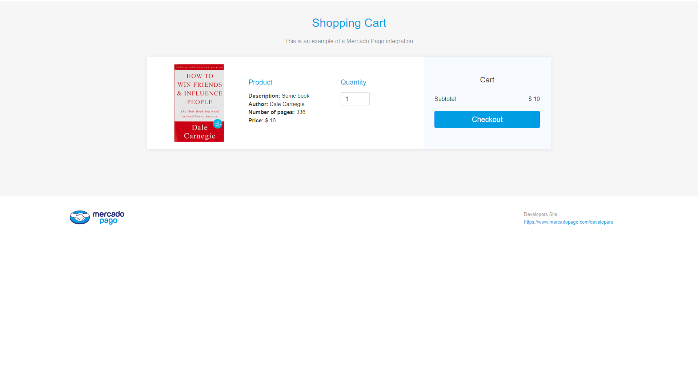
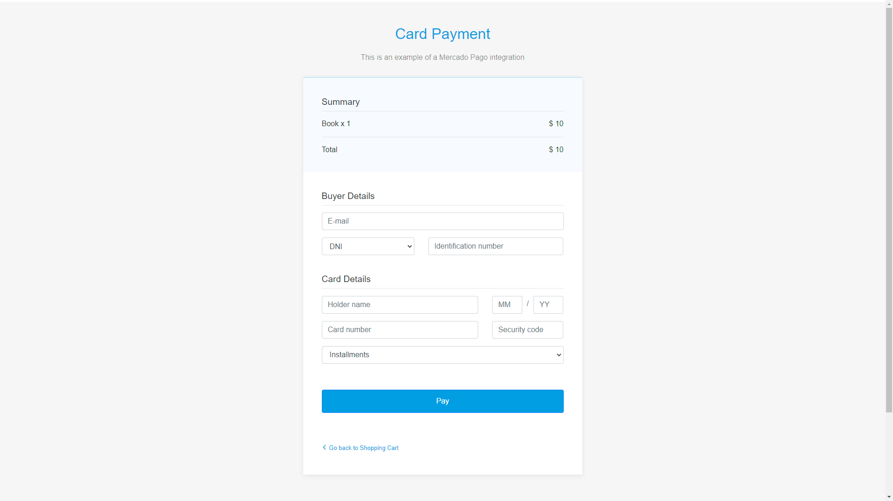
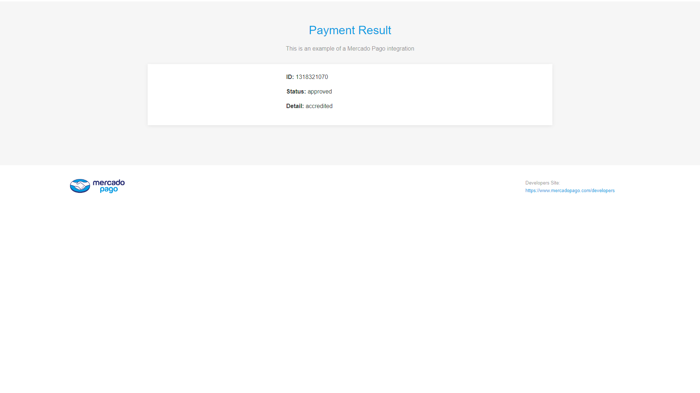

# Mercado Pago with Spring Boot and Maven

A simple proyect with Mercado Pago using spring boot

https://worldoftanks-react-ecommerce.netlify.app/

## Screenshots






## Tools Used

- Spring boot with maven
- [Google Gson](https://mvnrepository.com/artifact/com.google.code.gson/gson)
- [Mercadopago SDK](https://mavenlibs.com/maven/dependency/com.mercadopago/sdk-java)


## Environment Variables

To run this project, you will need to add the following environment variables to your .env file

`access_token`

`public_key`


## Run Application

```bash
  mvn spring-boot:run
```

## Authors

- [@Juan Ignacio Caprioli (ChanoChoca)](https://github.com/ChanoChoca)


## Badges

[//]: # (Add badges from somewhere like: [shields.io]&#40;https://shields.io/&#41;)

[](https://choosealicense.com/licenses/mit/)
[](https://opensource.org/licenses/)
[](http://www.gnu.org/licenses/agpl-3.0)
